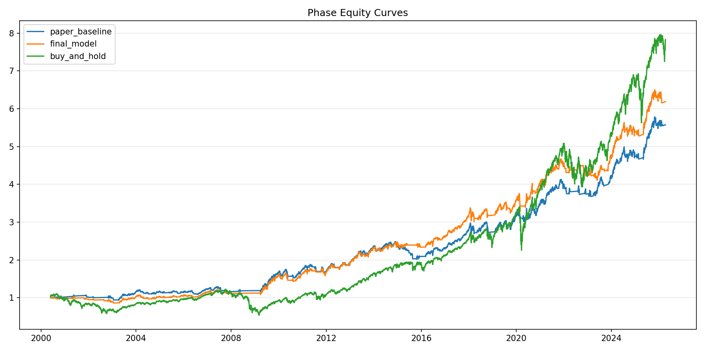
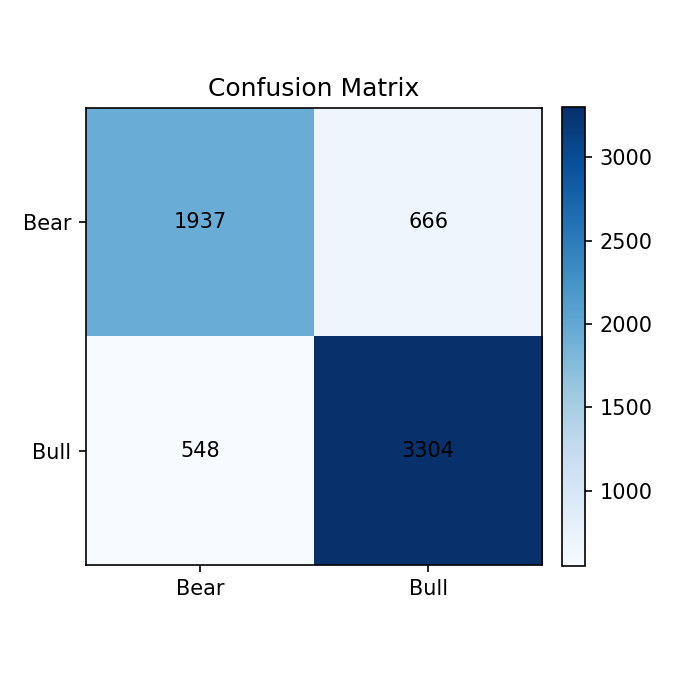
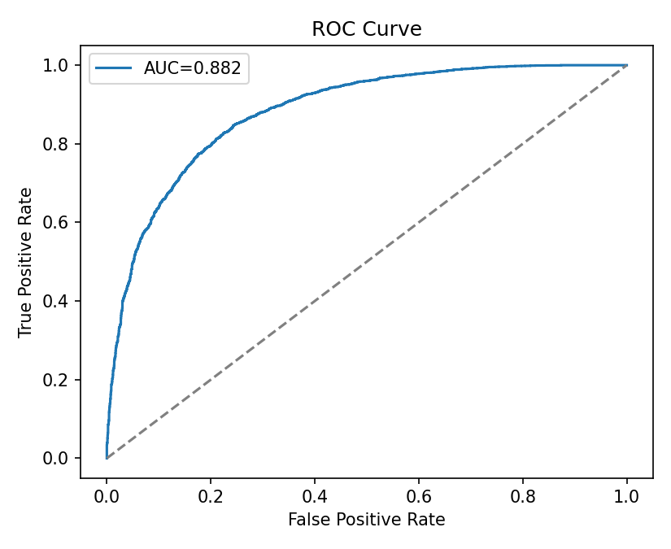
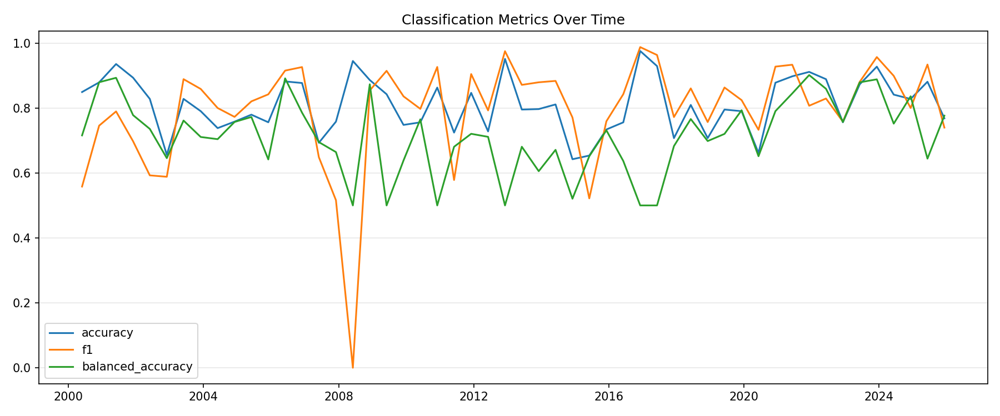

# Regime-Aware ML Overlay for SPY

This repository is a single-asset machine learning project that studies whether a regime-aware overlay can improve the risk-adjusted profile of holding `SPY`.

The project is intentionally focused on one research-to-trade mapping:

- Research asset: `^GSPC`
- Trade asset: `SPY`
- Unified backtest start date: `2000-05-26`

All active mainline results in this repository were rerun under that same protocol.

## Project Overview

The goal is not to build a pure market-timing strategy that simply beats `SPY` on absolute return. The goal is narrower and more defensible:

- improve downside protection
- preserve participation in recoveries
- evaluate the strategy as a regime-aware overlay / risk filter on top of long-only equity exposure

`^GSPC` is used as the research asset because it defines the signal-generation context, while `SPY` remains the execution asset because it is the tradable ETF.

## Main Takeaways

1. The oracle stage confirms that the JumpModel regime labels have economic value under the mapped `^GSPC -> SPY` research-to-trade structure.
2. Relative to the paper baseline, the final model improves annual return and Sharpe and also improves max drawdown.
3. The final model still does not beat buy-and-hold on absolute annual return, but it keeps Sharpe above buy-and-hold and retains materially better downside protection.

| Stage | Annual Return | Sharpe | Max Drawdown |
|---|---:|---:|---:|
| Paper baseline | 0.0694 | 0.5244 | -0.1873 |
| Final model | 0.0737 | 0.5731 | -0.1684 |
| Buy-and-hold | 0.0836 | 0.4172 | -0.5569 |

Mainline equity curve comparison:

## Research Question

Can a regime-aware ML overlay built on `^GSPC`:

- reduce left-tail damage and drawdowns
- improve recovery / re-entry after major selloffs
- maintain enough upside participation to remain useful over a long sample

## Methodology

The repository preserves the mainline path from label validation to the final overlay.

### 1. Oracle

`oracle_gspc_to_spy` is not a real trading model. It is a mapped label economic-value test.

- JumpModel produces the latent bull/bear regime labels on the research asset.
- The oracle stage is evaluated under the same `^GSPC -> SPY` structure used by the rest of the project.
- Its purpose is to test whether the label itself contains economic value before ML prediction is introduced.
- It is intentionally more conservative than a pure full-information upper-bound oracle and should not be read as the final tradeable strategy.

Entry point:
- [`scripts/run_oracle_gspc_to_spy.py`](scripts/run_oracle_gspc_to_spy.py)

Output:
- [`results/single_asset_mainline/oracle_gspc_to_spy`](results/single_asset_mainline/oracle_gspc_to_spy)

### 2. Paper Baseline

`paper_baseline_gspc_to_spy` is the closest approximation to a first-pass paper-style baseline.

- JumpModel + XGBoost
- baseline technical features only
- M0 macro features
- simple single-threshold execution rule

Entry point:
- [`scripts/run_paper_baseline_gspc_to_spy.py`](scripts/run_paper_baseline_gspc_to_spy.py)

Output:
- [`results/single_asset_mainline/paper_baseline_gspc_to_spy`](results/single_asset_mainline/paper_baseline_gspc_to_spy)

### 3. Feature Enhancement

`feature_enhanced_gspc_to_spy` adds the validated feature improvements while keeping the simpler execution rule.

- baseline technical features
- refined return-window features
- recovery-oriented trend features
- M0 macro features

This stage matters because it adds recovery-oriented structure without yet changing the execution logic.

Entry point:
- [`scripts/run_feature_enhanced_gspc_to_spy.py`](scripts/run_feature_enhanced_gspc_to_spy.py)

Output:
- [`results/single_asset_mainline/feature_enhanced_gspc_to_spy`](results/single_asset_mainline/feature_enhanced_gspc_to_spy)

### 4. Final Model

`final_model_gspc_to_spy` is the current single-asset mainline.

Research layer:
- `^GSPC`

Execution layer:
- `SPY`

Features:
- baseline technical features
- refined return-window features
- recovery-oriented trend features
- M0 macro features

Model:
- JumpModel with `n_components=2`, `jump_penalty=0.0`
- XGBoost with fixed production parameters

Execution layer:
- dynamic smoothing over `{0, 4, 8, 12}`
- fixed single threshold `0.55`
- extra entry rule:
  - `drawdown_from_peak <= -20%`
  - `probability > 0.52`

This final version is intentionally simpler than the old double-threshold branch. Under the unified protocol, the simpler execution layer translated probabilities into better trade decisions.

Entry point:
- [`scripts/run_final_model_gspc_to_spy.py`](scripts/run_final_model_gspc_to_spy.py)

Output:
- [`results/single_asset_mainline/final_model_gspc_to_spy`](results/single_asset_mainline/final_model_gspc_to_spy)

### 5. Diagnostics

The final stage is analyzed against the paper baseline using one unified diagnostic framework.

- phase performance
- bull / bear / hold state statistics
- re-entry lag analysis
- switching behavior
- downside protection summary
- exposure profile

Entry point:
- [`scripts/run_diagnostics_baseline_vs_final.py`](scripts/run_diagnostics_baseline_vs_final.py)

Output:
- [`results/single_asset_mainline/diagnostics_baseline_vs_final`](results/single_asset_mainline/diagnostics_baseline_vs_final)

## Data

Research asset:
- `^GSPC`

Trade asset:
- `SPY`

Macro inputs:
- current M0 macro panel in [`data_features/macro_feature_panel_m0.csv`](data_features/macro_feature_panel_m0.csv)

Unified protocol:
- OOS start: `2000-05-26`
- train lookback: `11 years`
- validation lookback: `4 years`
- validation subwindow: `6 months`
- OOS block: `6 months`

## Results

Mainline summary under the unified `2000-05-26` protocol:

| Stage | Annual Return | Sharpe | Max Drawdown |
|---|---:|---:|---:|
| Oracle | 0.0217 | 0.0770 | -0.3089 |
| Paper baseline | 0.0694 | 0.5244 | -0.1873 |
| Feature enhanced | 0.0709 | 0.5368 | -0.1834 |
| Final model | 0.0737 | 0.5731 | -0.1684 |
| Buy-and-hold | 0.0836 | 0.4172 | -0.5569 |

### Interpretation

- The final model does not beat buy-and-hold on absolute annual return.
- Relative to the paper baseline, the final model improves annual return, Sharpe, and max drawdown.
- The final model keeps Sharpe above buy-and-hold.
- The final model's main value is downside protection plus improved recovery participation.
- The strategy is best interpreted as a downside protection overlay / risk filter.

Key outputs:

- final summary table:
  - [`results/single_asset_mainline/final_model_gspc_to_spy/strategy_performance_summary.csv`](results/single_asset_mainline/final_model_gspc_to_spy/strategy_performance_summary.csv)
- final strategy vs buy-and-hold:
  - [`results/single_asset_mainline/final_model_gspc_to_spy/strategy_vs_buyhold.png`](results/single_asset_mainline/final_model_gspc_to_spy/strategy_vs_buyhold.png)
- final ML figures:
  - [`results/single_asset_mainline/final_model_gspc_to_spy/confusion_matrix.png`](results/single_asset_mainline/final_model_gspc_to_spy/confusion_matrix.png)
  - [`results/single_asset_mainline/final_model_gspc_to_spy/roc_curve.png`](results/single_asset_mainline/final_model_gspc_to_spy/roc_curve.png)
  - [`results/single_asset_mainline/final_model_gspc_to_spy/classification_metrics_over_time.png`](results/single_asset_mainline/final_model_gspc_to_spy/classification_metrics_over_time.png)

### ML Diagnostics

Average OOS classification metrics:

| Model | Accuracy | Balanced Accuracy | F1 | Log Loss | ROC-AUC |
|---|---:|---:|---:|---:|---:|
| Paper baseline | 0.8133 | 0.6975 | 0.7843 | 0.4070 | 0.8307 |
| Final model | 0.8117 | 0.7146 | 0.7941 | 0.4192 | 0.8217 |

Interpretation:

- The final model improves balanced accuracy and F1 relative to the paper baseline.
- Accuracy is roughly flat, while log loss and ROC-AUC are slightly weaker than the baseline.
- This is consistent with the broader project conclusion: the final edge comes mainly from a better execution layer, not from a wholesale jump in raw classifier quality.
- The time-series plot below is useful because it shows that classification quality is not constant across windows; the overlay has to survive changing regime conditions rather than a single stable ML environment.

Confusion matrix:

ROC curve:

Classification metrics over time:

## Diagnostics

The unified diagnostic result supports the following interpretation:

- this is best understood as a downside protection overlay / risk filter
- the final model improves on the baseline through a simpler and more effective execution layer
- it still trails buy-and-hold over long uninterrupted bull markets because average equity exposure remains below 1

See:
- [`results/single_asset_mainline/diagnostics_baseline_vs_final/diagnostic_summary.md`](results/single_asset_mainline/diagnostics_baseline_vs_final/diagnostic_summary.md)

## Rejected Directions

The following directions were tested but do not belong to the current mainline:

- double-threshold plus inertia hold under the unified protocol
- rising_2d extra entry layered on top of the new drawdown-conditioned baseline
- portfolio-level drawdown stop overlays

These remain available under the archived exploratory track:

- [`archive/scripts`](archive/scripts)
- [`archive/results`](archive/results)

## Project Structure

Top-level structure after cleanup:

- `data_raw/`: raw market and macro inputs
- `data_features/`: feature files and macro panels
- `scripts/`: active single-asset mainline and shared support scripts
- `results/single_asset_mainline/`: active mainline outputs
- `archive/scripts/`: archived exploratory scripts
- `archive/results/`: archived exploratory results

Active mainline scripts:

- [`scripts/single_asset_gspc_spy_common.py`](scripts/single_asset_gspc_spy_common.py)
- [`scripts/run_oracle_gspc_to_spy.py`](scripts/run_oracle_gspc_to_spy.py)
- [`scripts/run_paper_baseline_gspc_to_spy.py`](scripts/run_paper_baseline_gspc_to_spy.py)
- [`scripts/run_feature_enhanced_gspc_to_spy.py`](scripts/run_feature_enhanced_gspc_to_spy.py)
- [`scripts/run_final_model_gspc_to_spy.py`](scripts/run_final_model_gspc_to_spy.py)
- [`scripts/run_diagnostics_baseline_vs_final.py`](scripts/run_diagnostics_baseline_vs_final.py)

## Reproducibility

To reproduce the active mainline:

1. Ensure the required raw files and macro panel exist.
2. Run the stages in order:
   - `python scripts\run_oracle_gspc_to_spy.py`
   - `python scripts\run_paper_baseline_gspc_to_spy.py`
   - `python scripts\run_feature_enhanced_gspc_to_spy.py`
   - `python scripts\run_final_model_gspc_to_spy.py`
   - `python scripts\run_diagnostics_baseline_vs_final.py`

All active outputs will be written under:
- [`results/single_asset_mainline`](results/single_asset_mainline)

## Future Work

Multi-asset extension is future work. The current repository intentionally focuses on the single-asset `^GSPC -> SPY` problem.

The repo still retains future extension interfaces through the shared download / mapping utilities in:

- [`scripts/final_multi_asset_project_common.py`](scripts/final_multi_asset_project_common.py)

That means future research can add more research tickers and trade mappings without rebuilding the entire project layout.

## Conclusion

The final model is not a pure market-beating timing alpha strategy. It is a regime-aware downside protection overlay. Relative to the paper baseline, it improves annual return, Sharpe, and drawdown through a simpler execution layer built around dynamic smoothing, a fixed single threshold, and a drawdown-conditioned extra entry rule.

